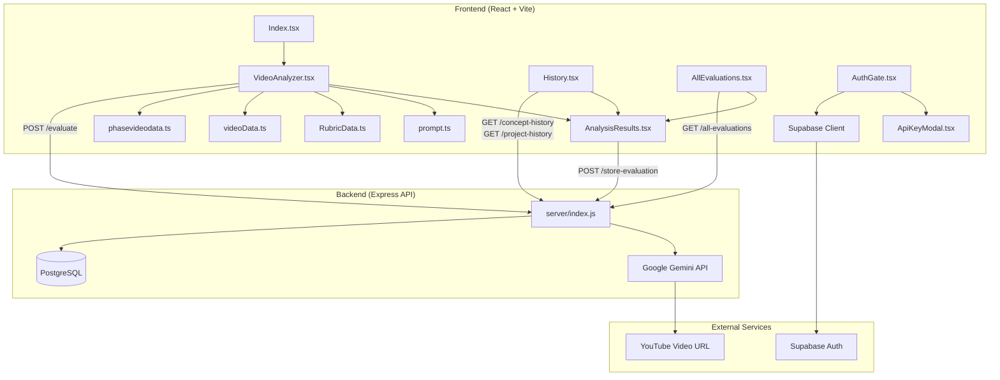

# Athena Project Context — YouTube Video Feedback

---

## 1. Project Overview

**YouTube Video Feedback** is a full-stack web application that evaluates educational YouTube videos (concept explanations and project walkthroughs) using **Google Gemini AI**. It is built for assessing student-created web development videos across multiple learning phases (HTML, CSS, JavaScript, APIs, Node.js/Express, MongoDB).

### Main Purpose
- Allow students to submit YouTube video URLs of their project walkthroughs or concept explanations.
- Use AI (Gemini 2.5 Flash) to evaluate the video against structured rubrics.
- Provide detailed, rubric-based feedback and scores.
- Store evaluation history per user in PostgreSQL.

### Key Features
- **Three evaluation modes:** Concept Explanation, Project Walkthrough, and Custom/Other.
- **Dual evaluation for concept videos:** Accuracy check + Ability-to-Explain assessment.
- **Rubric-based evaluation for project videos:** Phase-specific rubrics (Phase 1–6).
- **Custom evaluation:** Free-form prompt-based video analysis.
- **Google OAuth** authentication via Supabase.
- **User-provided Gemini API key** management (stored in browser localStorage).
- **Evaluation history** with view, re-open, and delete capabilities.
- **Admin view** ([`AllEvaluations`](src/pages/AllEvaluations.tsx)) for browsing all evaluations.
- **Neobrutalist UI** with shadcn/ui, Tailwind CSS, and Framer Motion animations.

### Technology Stack

| Layer        | Technology                                                        |
|--------------|-------------------------------------------------------------------|
| Frontend     | React 18, TypeScript, Vite, React Router, Tailwind CSS, shadcn/ui, Framer Motion |
| Backend      | Node.js, Express (ES Modules), `@google/genai`, `pg` (PostgreSQL) |
| Database     | PostgreSQL (AWS RDS)                                              |
| Auth         | Supabase (Google OAuth)                                           |
| AI           | Google Gemini 2.5 Flash (native video analysis)                   |
| Deployment   | Amplify (frontend), Railway/Render (backend)                      |

---

## 2. File and Module Summary

### Frontend

| File / Module | Purpose | Key Exports / Functions | Dependencies |
|---|---|---|---|
| [`src/App.tsx`](src/App.tsx) | Root component. Sets up React Router, `QueryClientProvider`, and `ApiKeyContext` for Gemini key management. | `App`, `ApiKeyContext` | `react-router-dom`, `@tanstack/react-query`, Supabase client |
| [`src/pages/Index.tsx`](src/pages/Index.tsx) | Landing/home page with hero section, feature cards, and call-to-action. | `Index` | `MotionWrapper`, `AnimatedHeading`, `Footer` |
| [`src/pages/VideoAnalyzer.tsx`](src/pages/VideoAnalyzer.tsx) | **Core evaluation page.** Handles video type selection, phase/video title selection, prompt construction, API calls to backend, and navigation to results. | `VideoAnalyzer` | Rubrics from [`RubricData.ts`](src/data/RubricData.ts), prompts from [`prompt.ts`](src/data/prompt.ts), video data from [`videoData.ts`](src/data/videoData.ts) & [`phasevideodata.ts`](src/data/phasevideodata.ts), `ApiKeyContext` |
| [`src/pages/AnalysisResults.tsx`](src/pages/AnalysisResults.tsx) | Displays evaluation results. Handles concept (accuracy + ability), project (rubric parameters), and custom evaluation display. Shows detailed feedback cards. | `AnalysisResults` | React Router state, Framer Motion |
| [`src/pages/History.tsx`](src/pages/History.tsx) | Shows the logged-in user's past evaluations (concept, project, custom). Supports delete and re-view. | `History` | Supabase auth, backend API |
| [`src/pages/AllEvaluations.tsx`](src/pages/AllEvaluations.tsx) | Admin/teacher view of all evaluations across users with search, filter, sort, and pagination. | `AllEvaluations` | Supabase auth, backend API |
| [`src/data/prompt.ts`](src/data/prompt.ts) | Contains all AI prompt templates and structured output schemas for Gemini. Defines `AccuracyPrompt`, `AbilityToExplainPrompt`, `ProjectPrompt`, `CustomPrompt`, and their JSON configs. | `AccuracyPrompt`, `AccuracyConfig`, `AbilityToExplainPrompt`, `AbilityToExplainConfig`, `ProjectPrompt`, `projectconfig`, `CustomPrompt`, `CustomConfig` | `@google/genai` (Type enum) |
| [`src/data/RubricData.ts`](src/data/RubricData.ts) | Defines all evaluation rubrics: `abilityToExplainRubric`, `Phase1Rubric` through `Phase6Rubric`. Each rubric is an array of parameter objects with weightages and level descriptions. | `abilityToExplainRubric`, `Phase1Rubric`, `Phase2Rubric`, `Phase3Rubric`, `Phase4Rubric`, `Phase5Rubric`, `Phase6Rubric` | None |
| [`src/data/videoData.ts`](src/data/videoData.ts) | Defines concept video metadata per phase: titles, "what to cover", and questions to answer. Provides helper functions to query video data. | `videoDataStructure`, `getPhaseNames()`, `getVideoTitlesForPhase()`, `getVideoDetailsForTitle()` | None |
| [`src/data/phasevideodata.ts`](src/data/phasevideodata.ts) | Defines project video metadata per phase (one project video per phase). Provides helper to get project video details. | `projectVideoDataStructure`, `getProjectPhaseNames()`, `getProjectVideoForPhase()` | None |
| [`src/components/AuthGate.tsx`](src/components/AuthGate.tsx) | Wraps protected routes. Forces Google OAuth login via Supabase and triggers API key modal if missing. | `AuthGate` | Supabase client, `ApiKeyContext` |
| [`src/components/ApiKeyModal.tsx`](src/components/ApiKeyModal.tsx) | Blocking modal that collects user's Gemini API key. Validates format (`AIza...`). | `ApiKeyModal` | `ApiKeyContext` |
| [`src/components/Header.tsx`](src/components/Header.tsx) | Navigation header with auth state display and route links. | `Header` | Supabase client |
| [`src/components/MotionWrapper.tsx`](src/components/MotionWrapper.tsx) | Reusable Framer Motion animation wrapper with configurable direction and delay. | `MotionWrapper` | `framer-motion` |
| [`src/components/AnimatedHeading.tsx`](src/components/AnimatedHeading.tsx) | Animated page heading component. | `AnimatedHeading` | `framer-motion` |
| [`src/components/CelebrationEffect.tsx`](src/components/CelebrationEffect.tsx) | Confetti-style celebration animation shown on evaluation completion. | `CelebrationEffect` | `framer-motion` |
| [`src/integrations/supabase/client.ts`](src/integrations/supabase/client.ts) | Supabase client initialization with auto-refresh and localStorage persistence. | `supabase` | `@supabase/supabase-js` |
| [`src/types/evaluation.ts`](src/types/evaluation.ts) | Centralized TypeScript interfaces for evaluation data structures. | `StructuredFeedback`, `AccuracyEvaluationItem`, `AbilityEvaluationItem`, `ProjectParameter`, etc. | None |
| [`src/types/components.ts`](src/types/components.ts) | TypeScript interfaces for component props. | `MotionWrapperProps`, `AnimatedHeadingProps`, etc. | None |

### Backend

| File / Module | Purpose | Key Functions / Endpoints | Dependencies |
|---|---|---|---|
| [`server/index.js`](server/index.js) | **Main backend entry point.** Express server with all API endpoints, PostgreSQL pool, Gemini API integration, CORS, and error handling. | `POST /evaluate`, `POST /store-evaluation`, `GET /concept-history`, `GET /project-history`, `GET /concept-evaluation/:id`, `GET /project-evaluation/:id`, `DELETE /concept-evaluation/:id`, `DELETE /project-evaluation/:id`, `GET /health` | `express`, `pg`, `@google/genai`, `cors`, `dotenv` |
| [`server/.env`](server/.env) | Backend environment variables: PostgreSQL credentials, port, Hugging Face key. | — | — |
| [`server/package.json`](server/package.json) | Backend dependencies and scripts. | `npm start` → `node index.js`, `npm run dev` → `node --watch index.js` | `@google/genai`, `pg`, `express`, `cors`, `dotenv`, `node-fetch` |

### Configuration & Build

| File | Purpose |
|---|---|
| [`vite.config.ts`](vite.config.ts) | Vite dev server config with proxy for `/evaluate` and `/store-evaluation` to `localhost:3001` |
| [`tailwind.config.ts`](tailwind.config.ts) | Tailwind CSS config with custom neobrutalist design tokens (`shadow-brutal`, HSL color vars) |
| [`amplify.yml`](amplify.yml) | AWS Amplify build spec for deployment |
| [`.env`](.env) | Root environment variables for frontend (Supabase URL/key, API URLs) |
| [`package.json`](package.json) | Frontend dependencies and scripts (`dev`, `build`, `start:api`, `start`) |

---

## 3. Architecture and Data Flow

### Overall Architecture

The application follows a **separate frontend/backend deployment** model:

- **Frontend** (React SPA) handles all UI, authentication, prompt construction, and result display.
- **Backend** (Express API) handles Gemini AI calls, database operations, and serves as a proxy for AI evaluation.
- **Database** (PostgreSQL on AWS RDS) stores evaluation history.
- **Supabase** is used exclusively for Google OAuth authentication (not for database queries).

### Data Flow

1. **Authentication:** User signs in via Google OAuth (Supabase). `AuthGate` checks session. If no Gemini API key in `ApiKeyContext`, `ApiKeyModal` blocks until user provides one.

2. **Video Submission:** User selects evaluation type (concept/project/other), phase, video title (for concept), and enters a YouTube URL in [`VideoAnalyzer.tsx`](src/pages/VideoAnalyzer.tsx).

3. **Prompt Construction:** Frontend assembles:
   - Video details (from [`videoData.ts`](src/data/videoData.ts) or [`phasevideodata.ts`](src/data/phasevideodata.ts))
   - Rubric (from [`RubricData.ts`](src/data/RubricData.ts))
   - Prompt template + JSON schema config (from [`prompt.ts`](src/data/prompt.ts))
   - User's API key (from `ApiKeyContext`)

4. **API Call:** Frontend sends `POST /evaluate` to backend with video URL, prompt, rubric, config, and API key.

5. **AI Evaluation:** Backend ([`server/index.js`](server/index.js)) calls Google Gemini API with the video URL (passed as `file_data.file_uri`) and prompt. Gemini analyzes the video and returns structured JSON.

6. **Response Processing:** Backend parses the JSON (with `repairJSON()` fallback for truncated responses) and returns it to the frontend.

7. **Result Display:** Frontend navigates to [`AnalysisResults.tsx`](src/pages/AnalysisResults.tsx) via React Router state, displaying scores, feedback, and rubric breakdowns.

8. **Storage:** User can save results. Frontend sends `POST /store-evaluation` to backend, which inserts into the appropriate PostgreSQL table (`tbl_ailabs_ytfeedback_concept_evaluations` or `tbl_ailabs_ytfeedback_project_evaluation`).

9. **History:** User views past evaluations via [`History.tsx`](src/pages/History.tsx), which fetches from `/concept-history` and `/project-history` endpoints.

### Dependency / Interaction Diagram

---

## 4. Key Concepts and Logic

### Core Concepts

1. **Dual Evaluation System (Concept Videos)**
   Concept videos undergo two sequential AI evaluations:
   - **Accuracy Check:** Determines if the explanation is >80% accurate. Uses [`AccuracyPrompt`](src/data/prompt.ts) with a structured schema that outputs accuracy percentage and concepts breakdown.
   - **Ability to Explain:** Rates explanation skill on a 4-level scale (Beginner → Expert/Feynman Level) using a 12-point checklist. Uses [`AbilityToExplainPrompt`](src/data/prompt.ts) and the [`abilityToExplainRubric`](src/data/RubricData.ts).

2. **Rubric-Based Project Evaluation**
   Project videos are evaluated against phase-specific rubrics ([`Phase1Rubric`](src/data/RubricData.ts) through [`Phase6Rubric`](src/data/RubricData.ts)). Each rubric has 2–4 parameters with weightages and 4 proficiency levels. The AI maps student performance to these levels and provides per-parameter feedback.

3. **Deterministic AI Evaluation**
   Prompts enforce deterministic behavior: `temperature: 0`, `topK: 1`, `seed: 42`, and explicit instructions to produce consistent scores. The [`projectconfig`](src/data/prompt.ts) and [`AccuracyConfig`](src/data/prompt.ts) objects define structured JSON response schemas using `@google/genai` Type enums.

4. **Gemini Native Video Analysis**
   YouTube URLs are passed directly to Gemini via `file_data.file_uri` — no video download or YouTube Data API is needed. Gemini natively processes video content.

5. **JSON Repair Pattern**
   Gemini sometimes returns truncated JSON. The backend [`repairJSON()`](server/index.js) function attempts to fix incomplete responses by closing open braces, brackets, and quotes.

6. **User-Provided API Key Management**
   Users provide their own Gemini API key via [`ApiKeyModal`](src/components/ApiKeyModal.tsx). The key is stored in React context ([`ApiKeyContext`](src/App.tsx)) and `localStorage`, sent with each request, and the backend falls back to its environment variable if no user key is provided.

7. **Phase-Based Content Structure**
   The project organizes learning into 6 phases:
   - Phase 1: HTML Only
   - Phase 2: CSS Styling
   - Phase 3: JavaScript
   - Phase 4: Modern JS + API Integration
   - Phase 5: Node.js/Express Backend
   - Phase 6: MongoDB & Mongoose

   Each phase has its own rubric, video data, and evaluation criteria.

8. **Route State for Data Passing**
   Evaluation results are passed between pages via `react-router-dom`'s `navigate('/analysis-results', { state: { ... } })` pattern, avoiding global state libraries.

9. **Separate Deployment Architecture**
   Frontend and backend have independent `package.json` files, environment variables, and deployment targets. The Vite dev proxy bridges them in development.

10. **Row-Level Security by Email**
    Database queries filter by user email. History endpoints require an `email` query parameter matching the authenticated user.

### Major Functions and Business Logic

1. **[`getVideoDetails()`](src/pages/VideoAnalyzer.tsx)** — Assembles the video details string based on selected phase, video title, and evaluation type. For concept videos, it pulls questions-to-answer from [`videoData.ts`](src/data/videoData.ts). For project videos, it pulls key topics from [`phasevideodata.ts`](src/data/phasevideodata.ts).

2. **[`handleAnalyze()`](src/pages/VideoAnalyzer.tsx)** — Main evaluation trigger. Validates inputs, constructs the request payload (video URL, prompt, rubric, config, API key), calls `POST /evaluate` (twice for concept videos — accuracy then ability), and navigates to results.

3. **`POST /evaluate` handler** in [`server/index.js`](server/index.js) — Receives evaluation request, initializes Gemini client with the user's API key, constructs the AI request with video URL as `file_data`, calls `generateContent()`, parses the JSON response, and returns structured evaluation data.

4. **`POST /store-evaluation` handler** in [`server/index.js`](server/index.js) — Routes storage by evaluation type (`concept`, `project`, or `custom`), inserts into the appropriate PostgreSQL table with parameterized queries.

5. **`repairJSON()`** in [`server/index.js`](server/index.js) — Attempts to fix truncated Gemini JSON responses by counting open/close braces and brackets, then appending missing closing characters.

6. **[`AccuracyPrompt`](src/data/prompt.ts)** — Instructs Gemini to evaluate concept accuracy using the formula: $\text{Accuracy} = \frac{(\text{CORRECT} + \text{PARTIAL} \times 0.5)}{\text{TOTAL}} \times 100$. Returns percentage and concepts breakdown.

7. **[`AbilityToExplainPrompt`](src/data/prompt.ts)** — Uses a 12-point checklist (Structure: 3pts, Examples: 3pts, Depth: 4pts, Accuracy: 2pts) to determine explanation level:
   - 0–4 points → Beginner
   - 5–7 points → Intermediate
   - 8–10 points → Advanced
   - 11–12 points → Expert (Feynman Level)

8. **[`ProjectPrompt`](src/data/prompt.ts)** — Enforces a 3-step deterministic evaluation: Video Validation → Topic Coverage Check → Parameter-by-Parameter Rubric Assessment. Uses exact weightages from the rubric.

9. **History fetching** in [`History.tsx`](src/pages/History.tsx) — Fetches from both `/concept-history` and `/project-history` endpoints in parallel, merges results, sorts by `created_at`, and renders unified evaluation cards.

10. **Result navigation from history** in [`History.tsx`](src/pages/History.tsx) and [`AllEvaluations.tsx`](src/pages/AllEvaluations.tsx) — Parses stored JSON evaluation data back into the format expected by [`AnalysisResults.tsx`](src/pages/AnalysisResults.tsx) and navigates with `{ state: { ..., fromHistory: true } }`.

---

## 5. References

### Must-Read Files for Understanding the Project

| Priority | File | Why |
|---|---|---|
| 🔴 1 | [`src/pages/VideoAnalyzer.tsx`](src/pages/VideoAnalyzer.tsx) | Core business logic — prompt construction, API calls, evaluation flow |
| 🔴 2 | [`src/data/prompt.ts`](src/data/prompt.ts) | All AI prompt templates and structured output schemas |
| 🔴 3 | [`server/index.js`](server/index.js) | Entire backend — API endpoints, Gemini integration, DB operations |
| 🟠 4 | [`src/data/RubricData.ts`](src/data/RubricData.ts) | All evaluation rubrics (Phase 1–6 + ability to explain) |
| 🟠 5 | [`src/pages/AnalysisResults.tsx`](src/pages/AnalysisResults.tsx) | Result rendering logic for all 3 evaluation types |
| 🟡 6 | [`src/data/videoData.ts`](src/data/videoData.ts) | Concept video metadata structure |
| 🟡 7 | [`src/data/phasevideodata.ts`](src/data/phasevideodata.ts) | Project video metadata structure |
| 🟡 8 | [`src/App.tsx`](src/App.tsx) | Routing setup and API key context |
| 🟢 9 | [`src/components/AuthGate.tsx`](src/components/AuthGate.tsx) | Authentication flow |
| 🟢 10 | [`src/pages/History.tsx`](src/pages/History.tsx) | History fetching and display pattern |

### Documentation Files

| File | Content |
|---|---|
| [`src/Docs/PROJECT_STRUCTURE.md`](src/Docs/PROJECT_STRUCTURE.md) | Complete architectural documentation |
| [`src/Docs/ARCHITECTURE_DIAGRAMS.md`](src/Docs/ARCHITECTURE_DIAGRAMS.md) | Visual architecture diagrams |
| [`src/Docs/REFACTORING_SUMMARY.md`](src/Docs/REFACTORING_SUMMARY.md) | Refactoring decisions and patterns |
| [`src/Docs/DEPLOYMENT.md`](src/Docs/DEPLOYMENT.md) | Deployment guide and checklist |
| [`server/README.md`](server/README.md) | Backend API documentation |
| [`.github/copilot-instructions.md`](.github/copilot-instructions.md) | Project conventions and workflows |

### Database Tables

| Table | Used For |
|---|---|
| `tbl_ailabs_ytfeedback_concept_evaluations` | Concept video evaluations (accuracy + ability to explain) |
| `tbl_ailabs_ytfeedback_project_evaluation` | Project video evaluations (rubric-based JSON) |

---

> **Note:** This document was generated from the `Variance-Test` branch of the [`navgurukul/yt-video-feedback`](https://github.com/navgurukul/yt-video-feedback) repository.